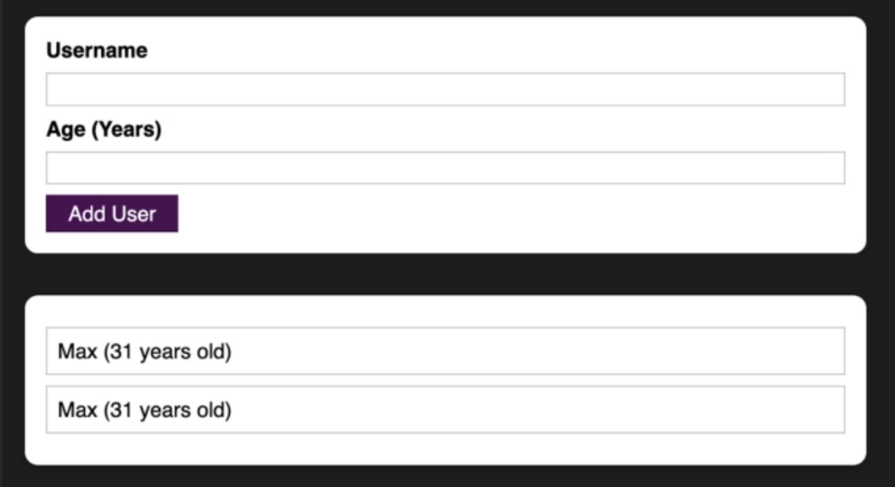

## User DB
A simple React demo app to add and list a set of users:

### UI:
Proposed form and list UI:

Modal window for validation erros:

### Validation:
Input should be validated in the following way:  
&nbsp;&nbsp;\- Name: not empty. Oprtionally - not containing any numbers  
&nbsp;&nbsp;\- Age: not negative  
A modal window should be displayed upon validation failure

### Components:
| Components Structire | Common UI components |
| ----------- | ----------- |
| <ul><li>App<ul><li>Card<ul><li>UserForm<ul><li>Input</li><li>Input</li><li>Button</li><li>? Modal</li></ul></li></ul></li><li>Card<ul><li>UserList<ul><li>UserRecord</li></ul></li></ul></li></ul></li></ul> | <ul><li>Card</li><li>Input</li><li>Button</li><li>Modal</li></ul> |

### State:
* App=> users: Array<User> ↓ (to the list)
    * UserForm=> user: User ↑  
&nbsp;&nbsp;&nbsp;&nbsp;&nbsp;&nbsp;&nbsp;&nbsp;&nbsp;&nbsp;&nbsp;&nbsp;&nbsp;&nbsp;&nbsp;&nbsp;&nbsp;&nbsp;&nbsp;&nbsp;&nbsp;&nbsp;&nbsp;isUserValid: boolean ↓ (to an input)

### Interfaces:
User:  
&nbsp;&nbsp;name: string  
&nbsp;&nbsp;age: number
